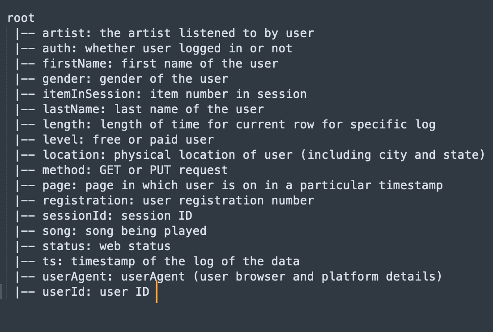
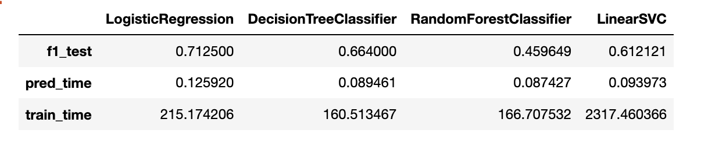

# Sparkify
## Project Summary/Motivation
This is "Udacity Data Scientist Nanodegree" Capstone project. It leverages 'Spark' big data framework. 'Sparkify' is an imaginary music streaming service that logs every user action as an event. Sparkify service is similar to 'Spotify' or 'Pandora' which are the digital music services using which users stream their favourite songs through the service every day. Some users use free-tiers that play advertisements between the streaming, and some users use paid premium subscription model where they stream the music ad. free. Users can upgrade, downgrade or cancel their service at any time. So, it's crucial to make sure that users love the service. If we can accurately identify users who will cancel the service, our business can provide them discount or incentives before they leave. This will save millions of business revenue. So,  the challenge is to use pyspark - Spark API in the python to extract insight and create meaningful features from raw data that allow us to predict which customer will cancel the service.
## Files Description
#### 1. Sparkify.ipynb    
A Python notebook which explores a smaller subset with the spark. The subset, mini_sparkify_event_data.json is of 128 MB. We are executing the following steps on top of this smaller subset of Sparkify data.
 - load and clean dataset
 - exploratory data analysis
 - define 'churn' using 'cancellation confirmation' page event
 - feature engineering
 - predictive modelling(churn classification)  

#### 2. requirements.txt
This file contains python libraries to be installed before running the python notebook.
Below are the required python libraries:
1. pyspark
2. numpy
3. pandas
4. seaborn
5. matplotlib

## Create a python environment, or a conda environment to run the project on local machine.
 - Python Environment
    - Install Python 3.8.x version or latest python version 
    - open command prompt and run following command to install required python dependencies
    ``` 
        pip install -r requirements.txt
    ``` 
 - Anaconda Environment
    - If you have anaconda installed on your machine, follow the steps to create conda environment
    ```
        conda create --name sparikify_conda_env pip python=3.8.0 anaconda
        conda activate sparikify_conda_env
        pip install -r requirements.txt

    ```
## Dataset Description
This project uses a tiny subset (128 MB) of the full dataset available (12 GB). There are 18 features with 286500 rows in the dataset. The columns are:

 
You can get full EDA(Exploratory Data Analysis) done on top of this tiny dataset from Sparkify.ipynb file.  

## Summary of Results
The 'churn prediction' is implemented based on the derived features, and some categorical features (gender and level). Since the churned users are fairly small subsets, we have used f1 score as the metric to optimise. 
We used below 4 classification machine learning algorithms for training. 
- Logistic Regression
- Decision Tree
- Random Forest
- Support Vector Machine 

After training we calculated f1-score on the test dataset. We got below evaluation result:
 

You can find my [blog post](https://medium.com/@deshmukhps95/user-churn-prediction-using-spark-959e3cab1a46) on medium for understanding complete flow and results from the project.
**Observations:**
- From the evaluation results above, it seems that LogisticRegression model is outperforming DecisionTreeClassifier, RandomForest and LinearSVC models.
- We got f1-score = 0.71 for logistic regression.
- We also got f1-score = 0.66 for decision tree. 
- We picked **logistic regression** for further fine-tuning. We used cross validation method using predefined grid of parameters. 
The training code can be found in Sparkify.ipynb file. 

## Conclusion
Our churn prediction model should help Sparkify to identify users for special promotions or other measures to prevent them from cancelling the service. However, the model should avoid falsely classifying loyal users as vulnerable to churn, because offering discounts or other promotions is expensive and should be targeted to users we would otherwise lose as customers.

## Acknowledgements
Thanks to Udacity as this project is completed as a part of [Udacity Data Scientist Nanodegree](https://www.udacity.com/course/data-scientist-nanodegree--nd025).